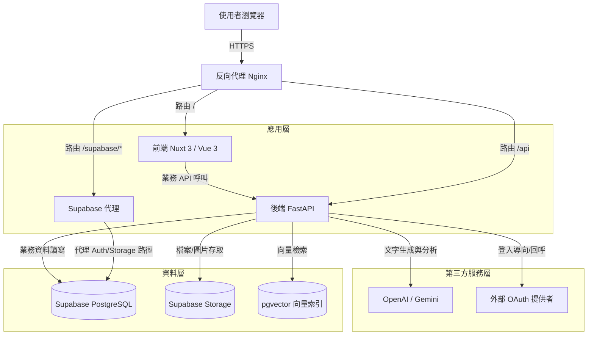
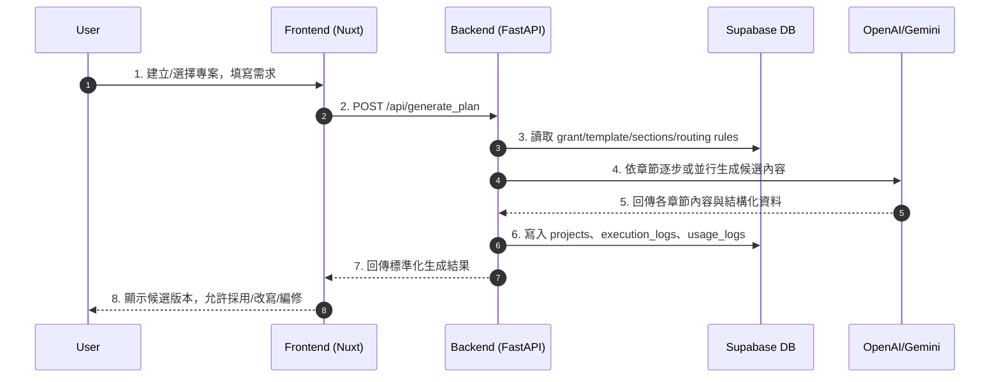
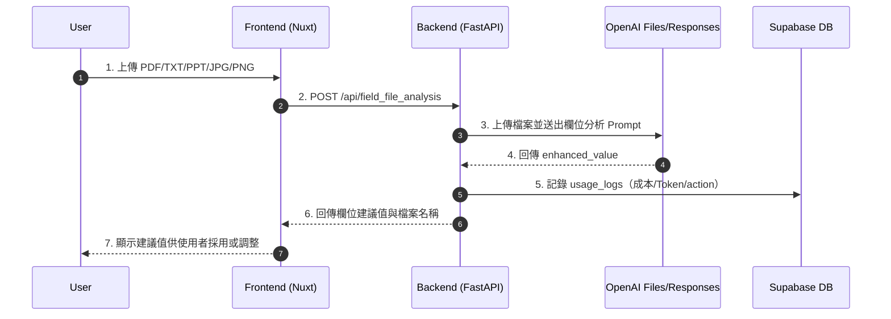

# 補助引擎（AI Proposal, AP）技術架構文

## 文件目的

本文件提供補助引擎（AI Proposal, AP）的完整技術藍圖，聚焦於實際程式架構、模組責任邊界、資料流向、風險與維運策略。目標是讓接手工程師在最短時間內掌握系統大腦（業務邏輯）與骨架（部署與資料層）。

## 0. 文件範圍與非範圍

### 0.1 文件範圍

- 前端 Nuxt 3 與後端 FastAPI 的核心架構。
- 反向代理（Nginx）、資料庫（Supabase）、LLM 服務整合。
- 生成流程、文件欄位分析流程、專案持久化流程。
- 監控、備份、故障排查與交接注意事項。

### 0.2 非範圍

- UI 視覺稿與互動細節設計規格。
- 商務策略、補助條文業務判讀規範。
- 模型訓練本身（本系統以推理與資料治理為主）。

## 1. 系統拓撲圖

本系統採前後端分離架構，Nginx 為統一入口，並將請求分流至前端、後端與 Supabase 代理路徑。

### 1.1 拓撲節點說明

- Client / Browser：操作專案、模板、章節與生成功能。
- Nginx：對外 TLS 入口與路由分流（`/`、`/api`、`/supabase`）。
- Frontend：處理互動流程、狀態管理、結果渲染與權限導向。
- Backend：核心業務流程引擎，負責 LLM 協調、資料落庫、治理與分析。
- Supabase DB：儲存系統主資料（設定、專案、日誌、資料集）。
- Supabase Storage：儲存 Logo、圖片與相關檔案。
- pgvector：用於 datasets 的 embedding 相似度檢索。
- External OAuth：外部登入授權與身份映射。

### 1.2 網路入口與路由策略

- `/`：前端 Nuxt 服務。
- `/api/*`：FastAPI 服務。
- `/supabase/*`、`/auth/v1/*`：透過 Nginx 代理至 Supabase 服務。

## 2. 核心技術選型與原因

### 2.1 前端（Nuxt 3 / Vue 3 / TypeScript）

- 優勢：
  - 適合中大型功能模組切分（projects、plan-library、template-manager）。
  - Composition API 便於封裝認證、生成、通知、載入等跨頁邏輯。
  - TypeScript 降低跨模組資料欄位命名不一致風險。

### 2.2 後端（FastAPI / Pydantic / Uvicorn）

- 優勢：
  - 非同步 I/O 適合高外部依賴場景（OpenAI/Gemini、Storage、DB）。
  - Pydantic 可做請求與響應結構驗證，降低資料污染。
  - 自動產生 OpenAPI 文件，有利前後端對齊與交接。

### 2.3 資料層（Supabase PostgreSQL + Storage + pgvector）

- 優勢：
  - 快速建置可維運的託管式資料層。
  - 以 SQL 結構化管理提案設定、專案與治理日誌。
  - embedding + pgvector 支援相似資料比對與檢索。

### 2.4 AI 能力層（OpenAI / Gemini）

- 優勢：
  - 同時支援文本生成、文件理解、欄位補全與圖片生成。
  - 可依路由規則在品質、速度、成本間動態平衡。

## 3. 分層責任邊界（重要）

### 3.1 前端責任

- 只負責呈現與交互，不承載核心業務判斷。
- 上傳檔案與參數收集後交由後端執行分析。
- 僅保存必要 session 狀態，不做資料庫直寫核心流程。

### 3.2 後端責任

- 解析請求、校驗參數、執行業務規則。
- 根據模板/章節/schema 組裝 prompt 與模型調度。
- 管理資料持久化與執行/成本日誌。
- 提供統一 API 與錯誤語意。

### 3.3 資料層責任

- 提供設定資料、專案資料、治理資料與審計資料。
- 作為生成流程的可追溯底座，不承擔應用層運算。

## 4. 核心業務流程

### 4.1 提案生成主流程

### 4.2 文件欄位分析流程

### 4.3 流程關鍵控制點

- 輸入校驗：檔案類型、數量、大小上限。
- 產出校驗：JSON 格式修復與內容有效性檢查。
- 成本記錄：外部模型呼叫即時計入 usage_logs。
- 可追溯性：流程事件寫入 execution_logs。

## 5. 啟動與快取機制

### 5.1 啟動載入

系統啟動時初始化核心服務，並將以下資料預載到 app state：

- model registry
- routing rules
- grants/templates/sections config
- datasets

### 5.2 手動刷新

配置異動後需透過 API 刷新：

- `POST /api/config/refresh`
- `POST /api/refresh-datasets`

### 5.3 風險提示

若改動模板/章節後未刷新快取，可能導致生成使用舊配置。

## 6. 核心模組與檔案責任

### 6.1 Backend API 層

- `generate`：生成、改寫、文件自動填寫、欄位檔案分析。
- `projects`：專案 CRUD、章節配置對應、時間軸與 PDF。
- `template_manager`：Grant/Template/Section 管理。
- `dynamic_section`：動態章節與欄位 CRUD。
- `datasets`：資料集治理、敏感詞建議。
- `images`：圖片生成、查詢與刪除。
- `usage_log`：使用量分析。
- `external_auth`：外部登入流程。

### 6.2 Service 層

- `llm_service`：模型呼叫封裝、重試、JSON 修復與輸出驗證。
- `supabase_service`：資料存取抽象、配置讀寫、日誌記錄、embedding 操作。

### 6.3 Frontend 層

- `pages/projects/*`：提案主流程頁。
- `components/chat/*`：生成交互元件。
- `components/template-manager/*`：配置管理 UI。
- `composables/useAppAuth.ts`：認證 session 與 token 處理。
- `middleware/auth.ts`：登入與 internal 權限檢查。

## 7. 資料模型與表格字典（摘要）

### 7.1 組態資料

- `grants`：補助主題。
- `plan_templates`：模板。
- `sections`：章節定義與 prompt。
- `section_schema_versions`：章節版本快照。

### 7.2 專案與追溯

- `projects`：專案主資料（含 saved_plan、stored_answer）。
- `execution_logs`：流程事件與時間軸資料。

### 7.3 治理與品質

- `datasets`：資料集條目（含 embedding）。
- `routing_rules`：模型路由規則。
- `usage_logs`：模型使用量與成本。

### 7.4 身份與權限

- `users`：使用者。
- `user_identities`：外部身份映射。
- `whitelist`：白名單控制（依環境策略）。

### 7.5 內容資源

- `images`：專案圖片。
- `commands`：使用者指令集。
- `draft_plans`：草稿與批次生成中間資料。
- `dynamic_sections`、`dynamic_fields`：動態表單配置。

## 8. 錯誤處理與穩定性策略

### 8.1 API 錯誤分層

- 4xx：輸入不合法、權限不足、資源不存在。
- 5xx：外部服務失敗、資料庫異常、解析失敗。

### 8.2 穩定性策略

- 外部呼叫重試與退避。
- 長流程逾時控制。
- 解析失敗時 JSON 修復機制。
- 臨時檔案（OpenAI files）使用後主動清理。

## 9. 安全與權限設計

### 9.1 認證路徑

- 一般登入：`/api/auth/*`
- 外部 OAuth：`/api/external-auth/*`

### 9.2 權限分級

- 一般使用者：僅可存取自身專案資源。
- 內部管理者：可使用管理端 API（builder/配置類）。

### 9.3 安全建議

- 祕鑰全部放環境變數，禁止入版控。
- 對管理 API 啟用最小權限。
- 強化 Nginx/TLS 與 cookie 安全策略。

## 10. 部署、監控與備份

### 10.1 部署形態

- Docker Compose：`fastapi-backend`、`nuxt-frontend`、`nginx-proxy`。

### 10.2 監控重點

- 容器重啟次數與存活狀態。
- API 錯誤率與平均延遲。
- usage_logs 成本趨勢。
- execution_logs 事件完整性。

### 10.3 常用維運指令

- `docker compose ps`
- `docker compose logs -f --tail=200 fastapi-backend`
- `docker compose logs -f --tail=200 nuxt-frontend`
- `docker compose logs -f --tail=200 nginx-proxy`

### 10.4 備份策略

- 資料庫每日備份（建議 Rclone + Cron）。
- 至少保留 30 天滾動版本。
- 每季執行一次還原演練。

## 11. 風險與待解決事項

### 11.1 Prompt 與程式碼耦合

- 風險：調整 AI 行為需發版。
- 建議：prompt 配置外部化 + 版本管理。

### 11.2 模型供應商依賴

- 風險：配額、速率限制、服務可用性波動。
- 建議：fallback provider、重試策略、告警。

### 11.3 成本風險

- 風險：多候選與大檔案分析造成成本飆升。
- 建議：上限控管 + 成本儀表板 + 每日預警。

### 11.4 配置一致性

- 風險：配置更新未刷新快取導致結果不一致。
- 建議：流程化執行 refresh API 並自動化驗證。

## 12. 交接清單

### 12.1 接手第一天必做

1. 確認 `.env` 變數完整與金鑰有效。
2. 本機或測試環境啟動三容器並驗證 API 健康。
3. 走完整一輪 `generate_plan` 與 `field_file_analysis`。
4. 檢查 `projects`、`execution_logs`、`usage_logs` 是否正確落庫。

### 12.2 變更上線前檢查

1. API 回傳格式是否破壞前端相容性。
2. 成本是否超出預期。
3. 權限是否有越權風險。
4. 快取是否已刷新且版本一致。

---

本文件為補助引擎現行架構基準版，若未來新增模型供應商、改變資料治理流程或調整部署拓撲，請同步更新此文件。
